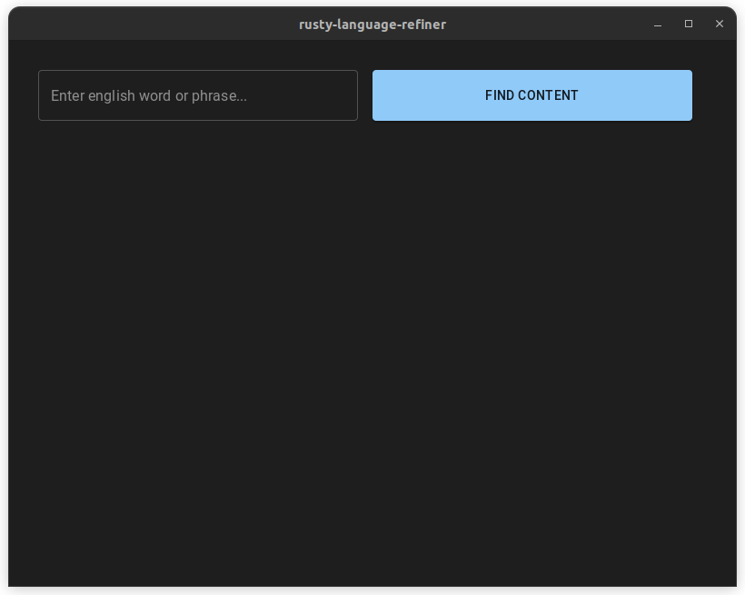
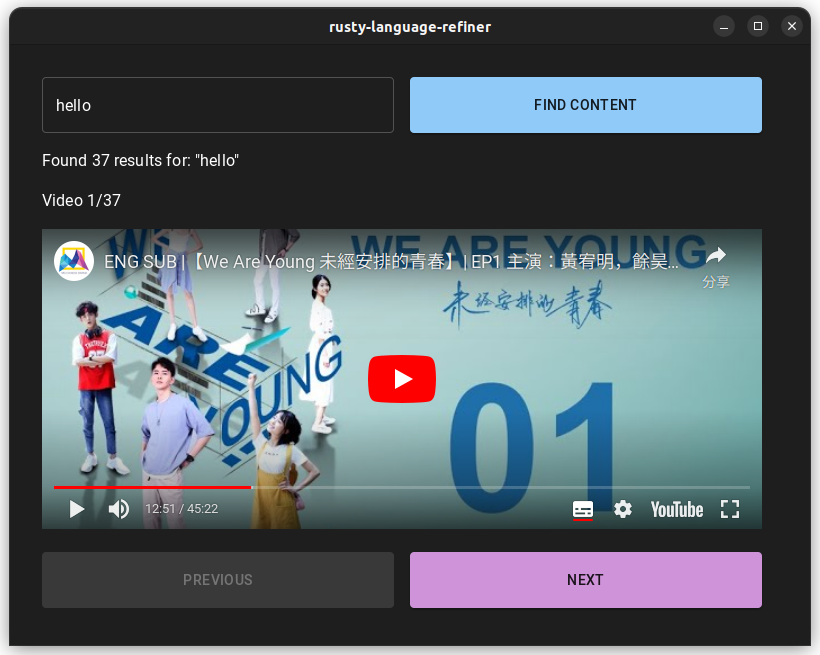

# Rusty-Language-Refiner

This is a basic app to search through multilingual youtube video transcripts and display translated words/terms in a target language. In this v0.0.0 release, the app has a database of ~100 videos in the chinese target language.

## User Documentation

This application is distributed as a `.AppImage` file for use on Linux (should work on WSL2 in Windows 11 but this is untested). AppImages require FUSE to run, if not already installed, please use your system package manager to install the `libfuse2` package. If you have another operating system, please see the Developer Documentation below to build for the correct platform.

### Running the Application

Assuming all dependencies are installed, the application can be run directly with the below command:

```
./path/to/rusty-language-refiner_0.0.0.AppImage
```

where the `./path/to` component is updated to the correct path to the executable.

#### Initial Screen

Upon startup, the app will display the following screen.



#### Search Results

You can type a word or phrase into the search box on the top right, and click "Find Content" button.



Click on play button in the video to play the clip, the video will automatically start at the relevant section of the stream.

You can navigate between results using the `Next` and `Previous` buttons.

## Developer Documentation

### Overview

The general application consists of two main components:

1. a React frontend serving the GUI components
1. a Tauri backend interacting with the index and query functions

In addition, due to time constraints, the web scraping script is a simple python script located at `src-tauri/resources/scraper.py`. The long-term goal is to translate this undocumented Youtube API to a rust crate.

### Recommended IDE Setup (taken from Tauri documentation)

- [VS Code](https://code.visualstudio.com/) + [Tauri](https://marketplace.visualstudio.com/items?itemName=tauri-apps.tauri-vscode) + [rust-analyzer](https://marketplace.visualstudio.com/items?itemName=rust-lang.rust-analyzer)

### Frontend

The frontend consists of two basic components:

1. a toplevel `App` component which creates a MaterialUI Grid with a query bar on top
1. a `VideoPlayer` component which accepts an array of `SearchResult` objects in the `videos` property.

Development on the frontend requires a `npm` version 16 or newer installed and available in the path.

### Backend

The backend is structured in two main components:

1. a binary crate, that parses the `src-tauri/resources/transcripts.json` file (baked into binary at compile-time), and interacts with the frontend
1. a `searcher` library crate, that includes generic indexing and query functions to allow multiple search strategies.

Development on the backend requires `cargo` to be installed and available in the path.

#### Searcher Library

The `searcher` library provides a generic indexing/searching capability as well as a preimplemented strategy for BM25.

A basic demonstration of how to use it (in rust) is as follows:

```rust
// define a function to tokenize our object
fn tokenizer(s: String) -> Vec<Token> {
  s.split_whitespace().collect::<Vec<_>>()
}

// define a function to access the text field of our object, in our case it is already text so
// just return a copy
fn accessor(s: &String) -> String {
  s.clone()
}

// construct an index
let mut index == Index::new();
index.add_document("Hello world".to_owned());
index.add_document("Goodbye world".to_owned());

// query the index using a strategy
let results = index.query("world", BM25::from(1.5, .75));

assert_eq!(results.len(), 2);
```

### Web Scraper

Due to time constraints, the web scraping script is a simple python script located at `src-tauri/resources/scraper.py`. This script parses a list of known youtube videos and uses a python module `python-transcript-api` to interact with undocumented youtube APIs and download the video transcripts in multiple languages.

To install the necessary dependencies to use the script, the following is the recommended command to run in your python development environment:

```
pip install src-tauri/resources/requirements.txt
```

The webscraper reads the `src-tauri/resources/tv_shows.json` file to find a list of youtube video IDs and creates an output file `src-tauri/resources/transcripts.json` in the same directory.

The long-term goal is to translate this undocumented Youtube API to a native rust crate. Another long-term goal would be to integrate with google developer application tokens to allow querying youtube videos through an official API, however this would only search to crawl for new videos, and does not support video transcripts.

### Building an Executable

To build an executable, all dependencies need to be installed as per the [Tauri Getting Started](https://tauri.app/v1/guides/getting-started/prerequisites) documentation. At this time, there is no support for cross-compilation.

#### Development Build

Development builds can be built with hot-reloading using the following command:

```
npm run tauri dev
```

#### Release Bundle

A release bundle (.AppImage on linux) can be built with the following command:

```
npm run tauri build
```

##### Linux

On linux, this produces an appimage bundle in the `src-tauri/target/release/appimage/rusty-language-refiner_0.0.0.AppImage` path. This can be run directly as a standalone executable on linux.
